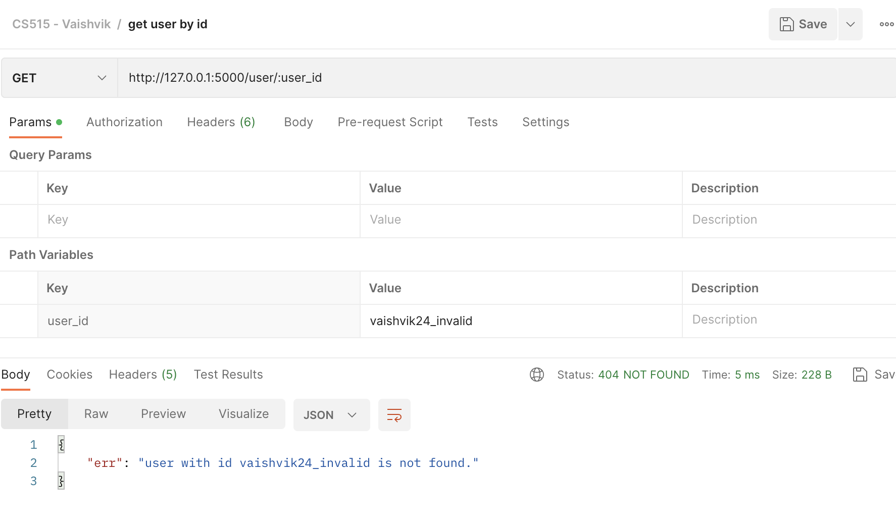
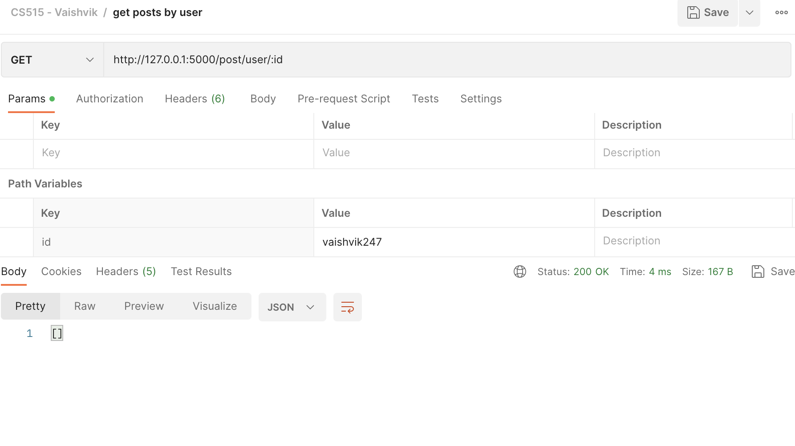
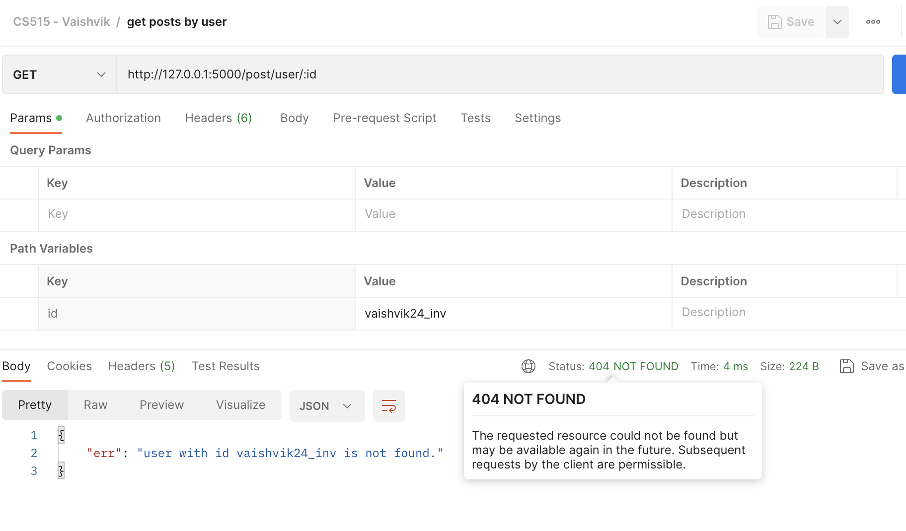

## Vaishvik Brahmbhatt vbrahmb2@stevens.edu
## Kush Patel kpatel24@stevens.edu, 
## Rishika Reva Kalakonda rkalakon@stevens.edu

#### GitHub URL: https://github.com/vaishvik24/CS515-Project3-Web_Forum

# CS 515: Project 3 - Web Forum in FLASK 🎮 

##  ⏰ Estimated hours: 42 hours

| Hours |                 Work                  |
|-------|:-------------------------------------:|
| 3     |    planning and managing the tasks    |
| 4     |    reading and understanding flow     |
| 7     |        implementing base flow         |
| 15    |       implementing 5 extensions       |
| 6     |    modification & refactoring code    |
| 5     |   testing code along with bug fixes   |
| 2     | creating README doc and GitHub set up |

##  🧪 Testing

- While implementing the base flow, I tested each function with writing doctests which helped to handle simple error cases. Once the API is ready to be tested, I start the flaks server and hit the request from the postman/curl request just to make sure it returns correct response and results. Even, I added a few more APIs to test overall working. I did testing with more cross cases just to make sure a key is unique and does not get conflicted with another which leads to make data into inconsistent stage.
- Once, we are done with baseflow, we merged our code into a single py file and did testing end-to-end with all extensions. 

## 🐛 Bugs/Issues

- The current final code has no bugs/issues identified during overall manual testing.
- Future improvement: We can have persistent storage which could be file based or any open databases. 

## 💡 Example of issues/bugs and solution for it

- The implementation of baseflow was easy but the user extension took time for us. The post can be deleted by key that could be user key or post key. So, identifying key whether it is post or user key was a time-consuming. Later, we found a catch and the issue got resolved.
- Even, we were stuck into the time based range queries because the input format of date and posted date could be different. Later, we use epoch timestamp which can be converted to any format as per requirements. 
- We tried to write our own postman JSONs for extension but it was a bit difficult to write our own cases. With the reference of the given jsons, we managed to write some testcases JSONs for our extensions.  

## 🧩 Extensions:
We've implemented 5 extensions. 
Postman collection Link: https://api.postman.com/collections/3753695-16d75404-5cc2-43f1-b13f-cbdd160c4fb0?access_key=PMAT-01GZA2XQG0D8N98N798EKCT46X

Each extension is described as below:
## 1. User Profiles (CURD operations)
- The service has several end points of create a user, get a user, and update a user.
- Each user entity consists of attributes as below:
  1. user_id: unique identifier to identify a user. This is unique per user and which can be changed or updated later. There are some constrains for username like it should have atleast a char, a number, does not contain a space and special characters etc. 
  2. key: this is the private user key which significance is described in the previous extensions.
  3. phone_num: a mobile number with the country extension
  4. name: full name of the user
  5. city: the location of a user

- Examples:  

1. Create a user
     ```http
     POST /user
     ```
  
    - Request body: 
    ```javascript
    {    
    "user_id": "vaishvik24",
    "name": "john richards",
    "phone_num" :"+1(606)-435-33322",
    "city": "hoboken, NJ"
    }
    ```
   - Response body: It adds a user with new id and generates unique key which can be used to access posts by the user.
    ```javascript
    {    
    "city": "hoboken, NJ",
    "created_at": "2023-04-30T23:11:25.873122",
    "key": "dc878f6938680f1046957ff602137580",
    "name": "john richards",
    "phone_num": "+1(606)-435-33322",
    "user_id": "vaishvik24"
    }
    ```
   - Refer screenshots for example:
   <table><tr><td>
   
   </td></tr></table>
    - If the same user id is used for second user then it fails with error bad request.
   <table><tr><td>
   
   </td></tr></table>


2. Get a user
     ```http
     GET /user/{{user_id}}
     ```
    - Input is user_id which is the id of the user whose data needed to search.

    - It you pass invalid user_id then it throws 404 not found error.



3. Update a user
   - This updates the data of the current user.
   ```http
     PUT /user/{{user_id}]
    ```
   - Input is user_id which is the id of the user whose data needed to search.
   - Request body: 
   ```javascript
   {    
   "name": "john richards",
   "phone_num" :"+1(606)-435-11111",
   "city": "California, CA"
   }
   ```
   - Response body: It updates the user with the given id.
   ```javascript
   {    
   "city": "California, CA",
   "created_at": "2023-04-30T23:11:25.873122",
   "name": "john richards",
   "phone_num": "+1(606)-435-11111",
   "user_id": "vaishvik24"
   }
   ```
    -  Refer below screen shots for reference:


    - It you pass invalid user_id then it throws 404 not found error.


## 2. User and User keys
- The conventional flow has a concept of simple posts. But, in order to delete and do more operation per post in future. So, remember key for each post is not a good way for system. So, posts created by a single user can be managed by a user using its private key. This would be given to user while creating of the user.  
- While creating a post, user id and user key has to be passed. If the user id does not match with user key then it would raise 403 forbidden error. If matched, then it creates a post with user id which can be used later. Even, this user key can be used to delete post as well. Instead of post key, a user key can be used as well.

- Examples:

1. Create a post by passing user id and user key. So, a post can be deleted with either post key and the user key.
   - Consider the base_url: http://127.0.0.1:5000/
   - Create Post for a user: 
     ```http
     GET /post
     ```
  
    - Request body: it includes a json object having message, id and key of the user.
     ```javascript
    {    
      "msg": "my name is vaishvik",
       "user_id": "vaishvik123",
       "user_key": "1a57d42eb71f5d000fca8c8ee14a70a5"
    }
    ```
     - It adds new paramter to the post that is used_id which shows that the post is associated with the user.
    - Once, you hit request, and it matches requirements then it create a post and return a response as below:  
     ```javascript
    {    
      "id": 1002,
      "key": "e63ad9abddfce35e53b57b5b72a2f699",
      "msg": "my name is vaishvik",
      "timestamp": "2023-04-30T21:57:54.653017",
      "user_id": "vaishvik123"
    }
    ```
     
    - As we know that a user `vaishvik123` with key  `1a57d42eb71f5d000fca8c8ee14a70a5`. 
    - If you want to delete this post `1002` then use user_key instead post_key to delete the post. 
   
2. If you pass, in correct user key in input body then it fails with 403 forbidden exception.
    - 

     
## 3. User based range queries
- The concept of user is a much useful to manage posts. This is the filter request which filters out the posts based by the user_id. 
- If the user does not exist then it throws 404 not found error. If found, then it returns list of posts for the given user.

- Examples: 
     ```http
     GET /post/user/{{user_id}}
     ```
    - It returns list of posts created by a user with user_id.
  <table><tr><td>
  
  </td></tr></table>

    - If the user does not have posted anything then returns empty list.
  
    - If the user does not exist, then it throws 404 not found exception.
  


## 4. Date- and Time-based range queries 
- This extension filters out the posts by the time. There are 2 query params have to passed which stands for start and end time of the interval.

- There are 2 case:
    1. If start_time is not specified, then it consider `January 1st, 1970 at 00:00:00 UTC` time.
    2. If end_time is not specified, then it takes it as the current time.
    3. If start and end time are not given, then throws 400 BAD Request error.
    4. If start time is greater than end time, then throws 400 BAD Request error as there is no such interval exist.
- Time format being used is: `ISO 8061 format` i.e.`2023-05-01T20:04:25.583859`.

     ```http
     GET /post?start_time={{x}}&end_time={{y}}
     ```
     - x and y are query parameters and in ISO 8061 time format. Either of one has to be passed.
  
- Examples: Consider different example and its output as per the aforementioned conditions.
  
  
  
  
  


## 5. Full text search
- In this extension, we simply filter out the text based on the input string.
- This is more like a search filter which checks whether the input string is in a message or not. 

     ```http
     GET /post?query={{query_message}}
     ```
     - query message is the input to be search. It returns list of posts which passed the filter `in` condition. 
     - If the query input is empty then it returns all the available message in the system.
- For example, if you want to search for posts containing the word "Flask", you can send a GET request to http://127.0.0.1:5000/posts?query=Flask.
Verify that the response contains a JSON object with the post information matching the search query. If the search query is not found in any post messages, an empty list will be returned.

- Examples: Consider the following examples for more context.
  
  
  
  
## 🏃‍Run Guide

- Install python 3 in your machine
- Read README.md file to get more context of the project
- The code is written in `app.py` file.
- The server is based on `flask` framework. First of all, you need to install flaks and other dependencies.
- Postman’s GUI is great for interactive testing; you can also use it to export a file for command-line testing, which will be necessary for us to evaluate your code. You can install the command-line tester by running npm install -g newman; if you’re missing the npm command, you need to install node and npmLinks to an external site. The nvmLinks to an external site and is a popular way to do that. 
  1. `setup.sh` shell script which downloads all dependencies
  2. `run.sh` shell script that starts flaks server at port 5000 (http://127.0.01:5000/ to check whether its running or not)
  3. `test.sh` shell script runs all tests (Make sure `npm` is installed as it uses `newman`)

```shell
  $ ./setup.sh
  $ ./run.sh
```
- Now, open new terminal and run following script to test the given usecases.
- Note: The testcases can be updated/added by changing JSON file given in the same root folder. 
```shell
  $ ./test.sh
```
